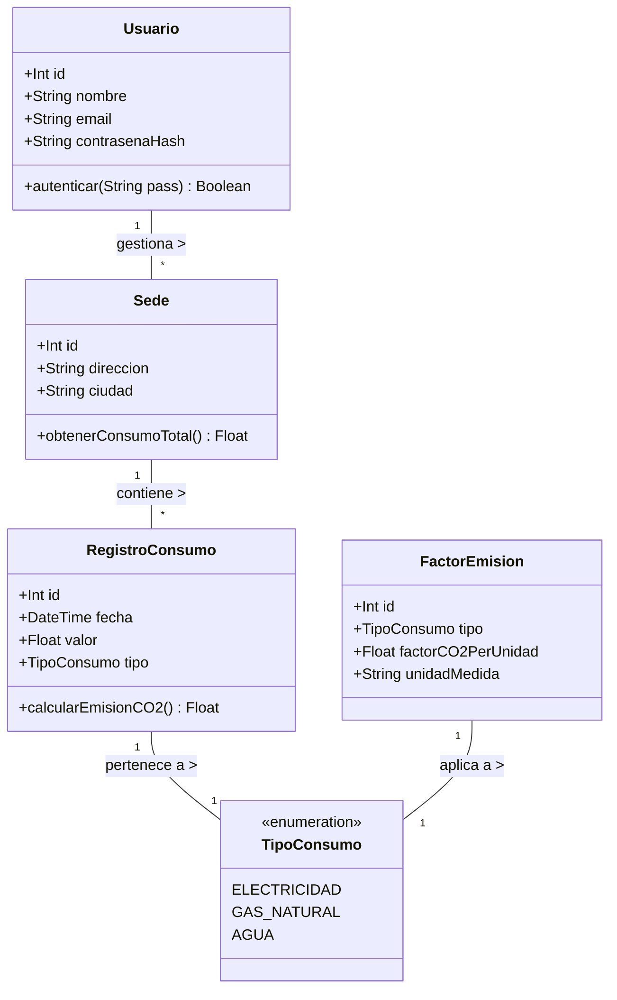

# Diseños del Sistema: Diagrama de Clases

A continuación se muestra el modelado de clases del dominio del sistema **EcoTrack**, representado mediante notación Mermaid.

## Descripción de Entidades

- **Usuario:** Representa al administrador o gestor dentro del sistema.
- **Sede:** Instalación o propiedad física perteneciente a la empresa a la que se le atribuyen consumos.
- **RegistroConsumo:** Entidad que almacena la cantidad de suministro utilizado en un periodo determinado.
- **FactorEmision:** Unidades de conversión configurables para calcular el impacto de carbono equivalente.
