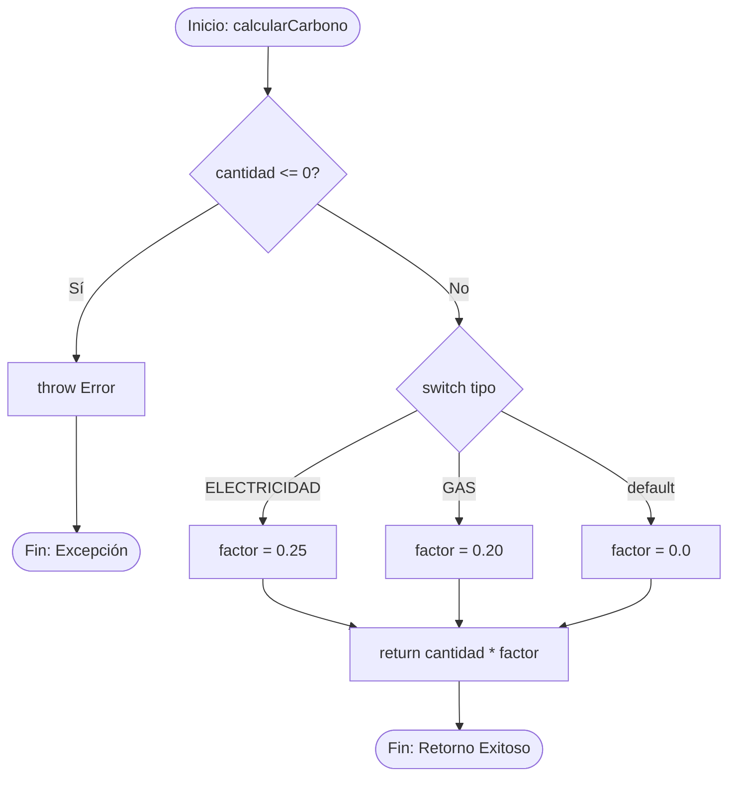

# Análisis de Caja Blanca: Módulo de Cálculo de Emisiones

Este documento detalla la prueba de caja blanca realizada sobre la función crítica de negocio `calcularCarbono`, responsable de determinar las emisiones de $CO_2$ producidas según el tipo de consumo.

## Código Fuente Evaluado

```javascript
/**
 * Calcula la emisión de CO2 basada en la cantidad consumida.
 * @param {string} tipo - "ELECTRICIDAD", "GAS" o "AGUA"
 * @param {number} cantidad - Valor consumido (debe ser > 0)
 * @returns {number} Emisión en kg CO2
 */
function calcularCarbono(tipo, cantidad) {
  if (cantidad <= 0) {
    throw new Error("La cantidad debe ser mayor a cero");
  }

  let factor;
  switch (tipo) {
    case "ELECTRICIDAD":
      factor = 0.25; // kg CO2 por kWh
      break;
    case "GAS":
      factor = 0.20; // kg CO2 por kWh
      break;
    default:
      factor = 0.0; // Consumos no emisores o desconocidos
      break;
  }

  return cantidad * factor;
}

```

## Grafo de Flujo de Control

A continuación se representa el flujo de ejecución de la función mediante un diagrama Mermaid:



## Cobertura de Caminos (Complejidad Ciclomática)

La complejidad ciclomática del algoritmo es **$V(G) = 4$**, lo que indica que existen **4 caminos independientes** necesarios para garantizar una cobertura de ramas y decisiones del $100\%$:

1. **Camino 1 (Excepción):** `cantidad <= 0` $\rightarrow$ Lanza error (`B -> C -> End1`).
2. **Camino 2 (Electricidad):** `cantidad > 0` $\land$ `tipo === "ELECTRICIDAD"` $\rightarrow$ Retorna `cantidad * 0.25` (`B -> D -> E -> H -> End2`).
3. **Camino 3 (Gas):** `cantidad > 0` $\land$ `tipo === "GAS"` $\rightarrow$ Retorna `cantidad * 0.20` (`B -> D -> F -> H -> End2`).
4. **Camino 4 (Por Defecto):** `cantidad > 0` $\land$ `tipo` no coincide con anterioridad $\rightarrow$ Retorna `0.0` (`B -> D -> G -> H -> End2`).

## Casos de Prueba Diseñados

| ID        | Entrada (`tipo`, `cantidad`) | Resultado Esperado        | Propósito del Test                               |
| --------- | ---------------------------- | ------------------------- | ------------------------------------------------ |
| **TC-01** | `("ELECTRICIDAD", -5)`       | `Error("La cantidad...")` | Validar límite de entrada negativa (Camino 1).   |
| **TC-02** | `("ELECTRICIDAD", 100)`      | `25.0`                    | Validar cálculo de energía eléctrica (Camino 2). |
| **TC-03** | `("GAS", 50)`                | `10.0`                    | Validar cálculo de consumo de gas (Camino 3).    |
| **TC-04** | `("AGUA", 200)`              | `0.0`                     | Validar ejecución de caso `default` (Camino 4).  |
